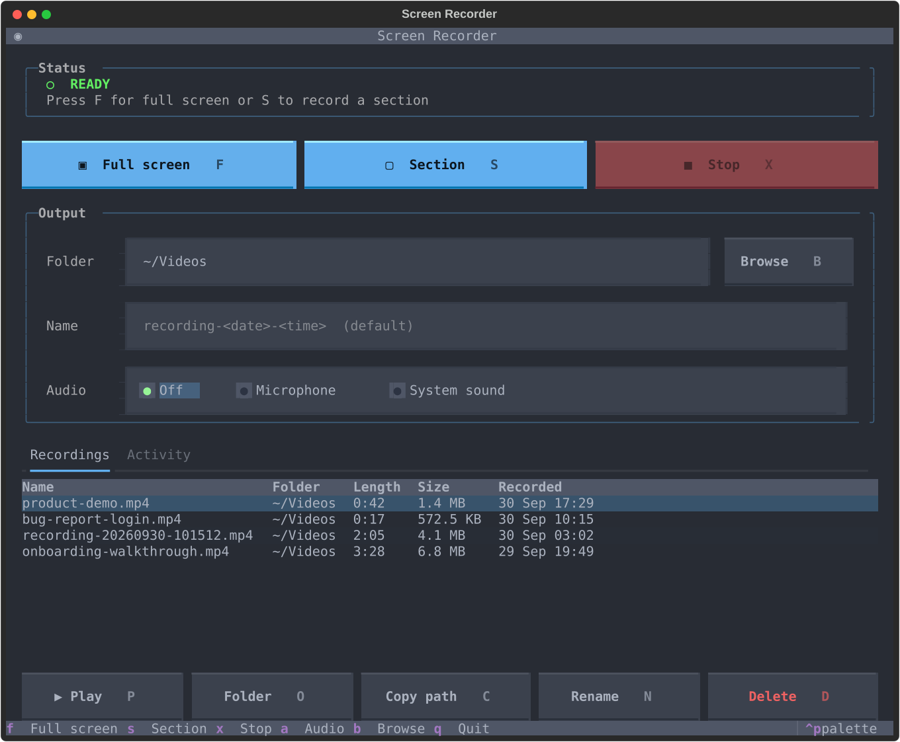

# screen-recorder-TUI

A small terminal UI for [wf-recorder](https://github.com/ammen99/wf-recorder) on Wayland (wlroots-based compositors such as niri, Hyprland, Sway). Start a full-screen or region recording and stop it from one screen, with no commands to remember.

Built with [Textual](https://textual.textualize.io/).



## Features

- **Full screen**: records the currently focused monitor (detected via `niri msg` or `hyprctl`; falls back to wf-recorder's default output)
- **Section**: pick an area with `slurp`, then record only that region
- **Stop**: sends `SIGINT` to wf-recorder (the same as Ctrl+C), so the file is closed properly
- Audio source: **Off**, **Microphone** (default input) or **System sound** (what's playing through your speakers)
- Countdown before recording starts (off, 3, 5 or 10 seconds) so you can get ready or switch windows
- Live timer while recording
- Desktop notification with the file path when a recording is saved
- **Recordings** list of your latest recordings: play, show in folder, copy path, rename or delete
- Choose the folder (with folder-name suggestions) and file name for each recording, or keep the defaults: `~/Videos/recording-YYYYMMDD-HHMMSS.mp4`

## Requirements

- Python 3.10+
- [`wf-recorder`](https://github.com/ammen99/wf-recorder)
- [`slurp`](https://github.com/emersion/slurp) (for region selection)
- `notify-send` (optional, from `libnotify`, for desktop notifications)
- `zenity` (optional, for the graphical *Save as* dialog)
- `ffprobe` (optional, from `ffmpeg`, to show recording lengths)
- `wl-copy` (optional, from `wl-clipboard`, for *Copy path*; otherwise the terminal's clipboard support is used)
- `xdg-open` (optional, from `xdg-utils`, to play recordings and open their folder; usually already installed)

On Arch Linux:

```bash
# Required
sudo pacman -S wf-recorder slurp

# Optional: notifications, Save as dialog, recording lengths, clipboard
sudo pacman -S libnotify zenity ffmpeg wl-clipboard
```

## Installation

```bash
git clone https://github.com/ivdobry/screen-recorder-TUI.git
cd screen-recorder-TUI
./install.sh
```

`install.sh` creates the virtualenv, installs the dependencies and links a `screen-recorder` command into `~/.local/bin`. The link points at your clone, so a `git pull` updates the command too; don't move or delete the folder afterwards.

- Use a different command name: `./install.sh srec`
- Install to another folder: `BIN_DIR=/some/dir ./install.sh`

## Uninstall

```bash
# 1. Remove the command (use the name/folder you installed with, if you changed them)
rm ~/.local/bin/screen-recorder

# 2. Remove saved settings (theme, folder, audio)
rm -r ~/.config/screen-recorder-tui

# 3. Remove the app itself, including its virtualenv
rm -rf /path/to/screen-recorder-TUI
```

Your recordings are not touched. They stay wherever you saved them (by default `~/Videos`).

## Usage

```bash
screen-recorder
```

(or `./run.sh` from the project folder without installing)

| Key | Action       | Command it runs                                  |
|-----|--------------|--------------------------------------------------|
| `F` | Full screen  | `wf-recorder -o <focused output> -f <file>`      |
| `S` | Section      | `wf-recorder -g "$(slurp)" -f <file>`            |
| `X` | Stop         | sends `SIGINT` to wf-recorder (or cancels the countdown) |
| `A` | Audio source | cycles Off → Microphone → System sound           |
| `T` | Countdown    | cycles Off → 3 s → 5 s → 10 s                    |
| `B` | Browse       | opens a file dialog to choose folder and name    |
| `Q` | Quit         | stops any active recording first, then exits     |

You can also click the buttons with the mouse.

### Folder and name

- **Save to**: the folder to save into (default `~/Videos`). `~` works, missing folders are created, and a suggested folder name can be accepted with `→`.
- **Name**: the file name. Leave it empty to use `recording-YYYYMMDD-HHMMSS`. `.mp4` is added if you don't give an extension; give one (e.g. `demo.mkv`) to use a different format.
- **Browse [B]** opens your system's *Save as* dialog (via `zenity`) to choose the folder and name. Without zenity, it opens a folder browser inside the terminal instead. Run `./run.sh --no-zenity` to always use the terminal browser.
- If the file already exists, `-1`, `-2`, … is added to the name, so recordings are never overwritten.
- Press `Enter` or `Esc` to leave a text field and use the keyboard shortcuts again.

### Countdown

With a countdown set (3 s by default), pressing `F`, or finishing your selection with `S`, doesn't start recording straight away. The Status card turns amber and counts down (*STARTING IN 3… 2… 1…*), then recording starts. A desktop notification also tells you when it will start, in case you've already switched away from the terminal. Press `X` to cancel.

To change the countdown, click the **◔** button next to Stop or press `T`. It cycles Off → 3 s → 5 s → 10 s, and the button shows the current setting. Choose **Off** to start immediately.

### Audio

| Option       | What it records                           | wf-recorder flag                         |
|--------------|-------------------------------------------|------------------------------------------|
| Off          | No audio                                  | none                                     |
| Microphone   | Your default input device                 | `--audio`                                |
| System sound | Everything playing on your default output | `--audio=<default sink>.monitor`         |

System sound needs `pactl` (included with PipeWire/PulseAudio). The output device is looked up each time a recording starts, so switching to headphones is picked up automatically.

Recording the microphone and system sound at the same time isn't supported yet, because wf-recorder only records from one audio device.

### Recordings

The **Recordings** tab at the bottom lists the last 20 recordings made with the app, newest first. After you stop a recording, it switches to this tab with the new file selected. Use `↑`/`↓` to pick one, then:

| Key            | Action                                                        |
|----------------|---------------------------------------------------------------|
| `P` or `Enter` | Play it in your default video player                          |
| `O`            | Open its folder in your file manager, with the file selected  |
| `C`            | Copy its full path to the clipboard                           |
| `N`            | Rename it (the extension is kept if you leave it out)         |
| `D`            | Delete it after you confirm: moved to the Trash with `gio trash`, or deleted permanently if `gio` is missing (the dialog says which) |

Files you move or delete outside the app disappear from the list automatically. The **Activity** tab shows the commands that were run and any errors.

### Tips

- A full-screen recording includes the terminal running the TUI. Use the countdown to switch to another workspace before it starts, or use **Section** to leave it out.
- To stop a recording without going back to the terminal, bind this to a key in your compositor config:

  ```bash
  pkill -INT wf-recorder
  ```

  The TUI notices that the recording ended and still saves and reports the file.

## Configuration

Your settings are saved to `~/.config/screen-recorder-tui/config.json` and restored the next time you start the app:

- **Theme**: press `Ctrl+P` → *Change theme*
- **Save to folder**: the last existing folder you typed or picked with Browse
- **Audio**: the selected audio source
- **Countdown**: the countdown length
- **Recordings**: the list of recent recordings

The file name is not remembered, so each session starts with the timestamp default. To reset everything, delete the config file. The built-in default folder (`~/Videos`) is `OUTPUT_DIR` at the top of `recorder.py`.

## License

[MIT](LICENSE) © 2026 ivdobry
